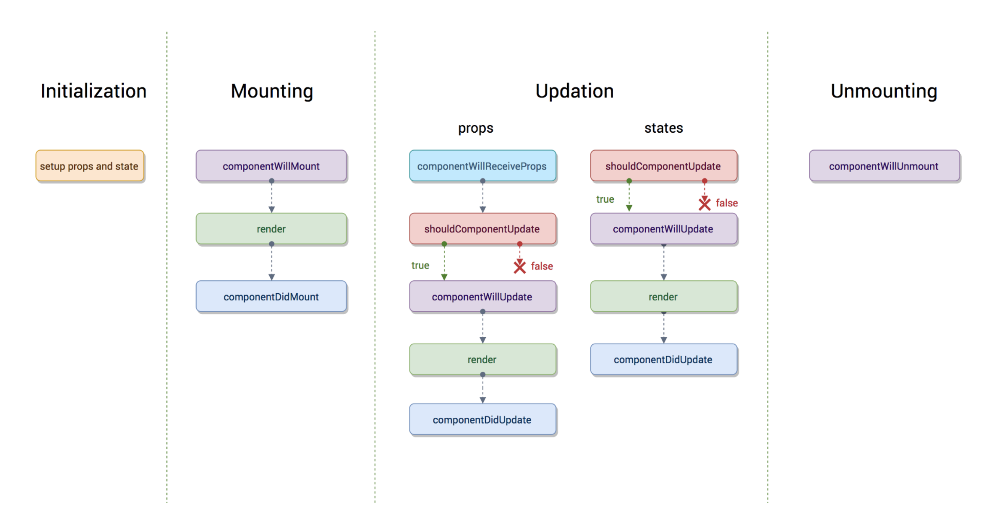

# react-bootcamp-fa18

# How to get user input



All Lifecycle Methods that exist

## Initialization 
### This is when the component sets up its state and inital props.


## Mounting
### The component is prepared with its basic needs, so its ready to mount in the browser DOM. 
* componentWillMount  
* render
* componentDidMount  

## Updating 
### Whenever the user interacts with the website and the state/props change
* componentWillReceiveProps  
* shouldComponentUpdate
* componentWillUpdate
* render
* componentDidUpdate  

## Unmounting
### When the component is no longer being rendered. 
* componentWillUnmount

## More advanced lifecycle Methods
static getDerivedStateFromProps() 
getSnapshotBeforeUpdate() 
componentDidCatch()


## Examples

Inside of App.js we can add the function, which will print out to the console. whenever that component is mounted.

```Javascript
componentDidMount() {
    console.log("componentDidMount")
  }
```

After adding this one, whenever we type anything into the text box to add a new todo, the state changes, so this function gets called. 
```Javascript
  componentDidUpdate() {
    console.log("componentDidUpdate")
  }
```
